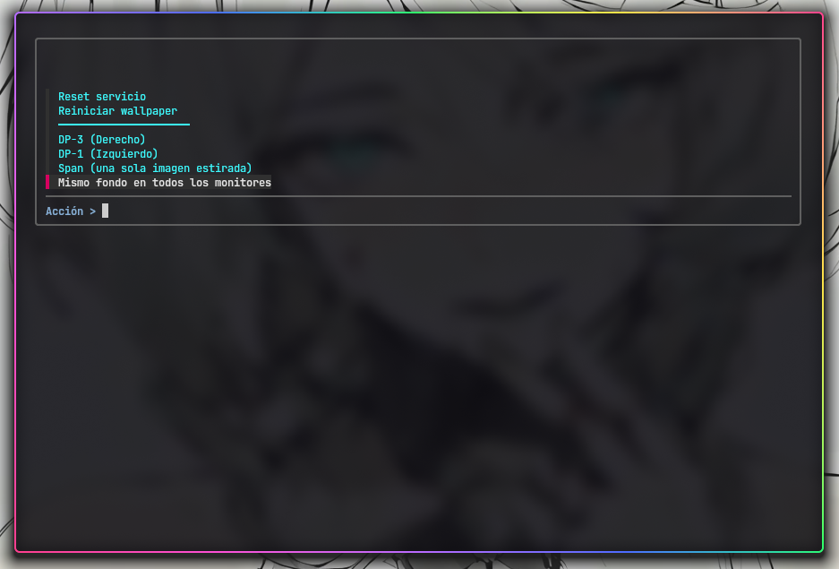
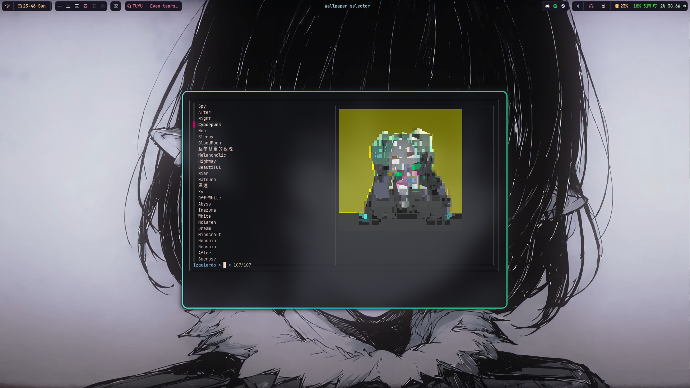

# wallpaper-engine-picker

A terminal UI for [linux-wallpaperengine](https://github.com/Almamu/linux-wallpaperengine) that lets you browse and apply Wallpaper Engine wallpapers from the command line, with live previews and multi-monitor support.




---

## Dependencies

- [Steam](https://store.steampowered.com/) with [Wallpaper Engine](https://store.steampowered.com/app/431960/Wallpaper_Engine/) installed and at least one wallpaper downloaded
- [linux-wallpaperengine](https://github.com/Almamu/linux-wallpaperengine) — follow their README for installation
- [`fzf`](https://github.com/junegunn/fzf) — fuzzy finder
- [`chafa`](https://hpjansson.org/chafa/) — terminal image previews
- [`jq`](https://jqlang.github.io/jq/) — JSON parsing
- `systemd` (user session)

Install dependencies on Arch:
```bash
paru -S fzf chafa jq
```
On Ubuntu/Debian:
```bash
sudo apt install fzf chafa jq
```

---

## Installation

1. Clone the repository:
```bash
git clone https://github.com/CabraLoca69/Linux-WE-SimpleUi.git
cd Linux-WE-SimpleUi
```
2. Edit the config file to match your setup (see [Configuration](#configuration)):
```bash
$EDITOR ./config
```
⚠️ **All scripts refuse to run until you do this.** The shipped config starts
with `DEFAULT=True` on purpose — running with empty `ASSETS`/`WORKSHOP` or a
placeholder `MONITORS` list fails in confusing, hard-to-debug ways further
down the line (wrong systemd unit state, wallpapers that silently don't
apply, etc). Instead, the scripts check this flag right after sourcing the
config and exit immediately with a clear message if it's still `True`.

Once you've set `MONITORS`/`ASSETS`/`WORKSHOP` for your machine, change the
first line of the config to:

```bash
DEFAULT=False
```

3. Run the installer:
```bash
chmod +x ./install
./install
```

---

## Configuration

All settings live in `~/.config/wallpaperengine/config`. Both scripts source this file automatically.

```bash
# ── Antes de nada ──────────────────────────────────────────────────────────
# Los scripts se niegan a correr mientras esto siga en True.
DEFAULT=True

# ── Monitors ───────────────────────────────────────────────────────────────
# To find your monitor names: hyprctl monitors | grep Monitor
# Or with: xrandr | grep " connected"
MONITORS=(
  "DP-1:Left"
  # "DP-3:Right"
  # "DP-2:Center"  # add or remove monitors as needed
)

# ── Wallpaper Engine ───────────────────────────────────────────────────────
# See: https://github.com/Almamu/linux-wallpaperengine/blob/main/README.md
# Or run: linux-wallpaperengine --help
FPS=30 
WE_ARGS=(--silent --disable-mouse)

# ── Paths ──────────────────────────────────────────────────────────────────
# Usually found a few directories above your wallpaper_engine install folder:
# */SteamLibrary/steamapps/common/wallpaper_engine/assets
ASSETS=""
# */SteamLibrary/steamapps/workshop/content/431960
WORKSHOP=""

# State files — where the picker saves the current wallpaper to restore on boot
STATE_DIR="$HOME/.config/wallpaperengine"
STATE="$STATE_DIR/last_wallpaper.json"
```

> **Tip:** To find your Steam library path, open Steam → Settings → Storage.

With a single monitor configured in `MONITORS`, the multi-monitor menu
options (below) don't show up — picking your one monitor directly already
covers that case.

---

## Usage

### Picker

```bash
wallpaper-picker
```

Opens a menu to:
- **Set a different wallpaper per monitor** — pick a monitor, pick a wallpaper for it
- **Mismo fondo en todos los monitores** — apply the *same* wallpaper to every monitor independently (each monitor renders its own instance via `--screen-root`; not a single stretched image)
- **Span (una sola imagen estirada)** — a *single* wallpaper stretched across the combined geometry of all monitors via `--screen-span` (only shows up with more than one monitor configured)
- Restart the wallpaper service
- Reset a failed systemd service (clears a stuck `wallpaperengine.service` from a previous crashed run — needed before `systemd-run` will accept starting a new one under the same unit name)

While browsing wallpapers, a live preview renders in the right panel using `chafa`.

### Restore on login

To restore your last wallpaper automatically when you log in, add this to your Hyprland config (or your compositor's equivalent):

```ini
exec-once = ~/.local/bin/wallpaper-on-start
```
or in .lua configurations:

```ini
hl.on("hyprland.start", function()
    hl.exec_cmd("wallpaper-on-start")
end)
```
---

## How it works

The picker saves the current wallpaper selection to `~/.config/wallpaperengine/last_wallpaper.json` and runs `linux-wallpaperengine` as a systemd user service (`wallpaperengine.service`, transient, created via `systemd-run`). On login, `wallpaper-on-start` reads that file and restores the wallpaper.

Every time a wallpaper is applied, the picker stops the running service and
clears its failed state (`systemctl --user reset-failed`) before starting a
new one — a transient unit that exited with an error stays "loaded" under
its name until explicitly cleared, and `systemd-run` refuses to reuse that
name otherwise (`Unit wallpaperengine.service was already loaded or has a
fragment file`).

---

## Troubleshooting

**`linux-wallpaperengine` says "At least one background ID must be specified"** — the state file (`last_wallpaper.json`) has no valid entry for the monitor you're targeting, or the wallpaper id in it doesn't correspond to a real folder under `$WORKSHOP`. Check:
```bash
cat ~/.config/wallpaperengine/last_wallpaper.json
ls "$WORKSHOP"   # confirm if the id really exists 
```

**`Failed to start transient service unit: ... already loaded or has a fragment file`** — a previous run of `linux-wallpaperengine` crashed and left `wallpaperengine.service` stuck in a `failed` state. The picker already clears this automatically before applying a new wallpaper; if you're calling `apply_wallpaper`-adjacent code directly, run:
```bash
systemctl --user reset-failed wallpaperengine.service
```

**Nothing happens, scripts exit immediately with a message about `DEFAULT`** — you haven't edited `~/.config/wallpaperengine/config` yet. See [Installation](#installation).

---

## Credits

- [linux-wallpaperengine](https://github.com/Almamu/linux-wallpaperengine) by Almamu — without this none of it works
- [Wallpaper Engine](https://store.steampowered.com/app/431960/Wallpaper_Engine/) by Kristjan Skutta

---

## License

MIT